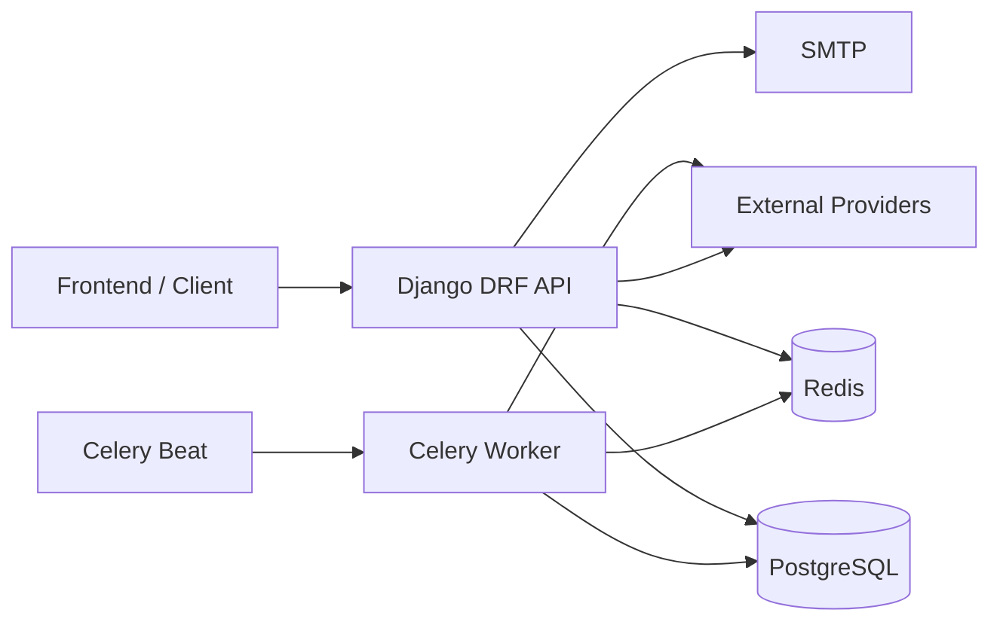
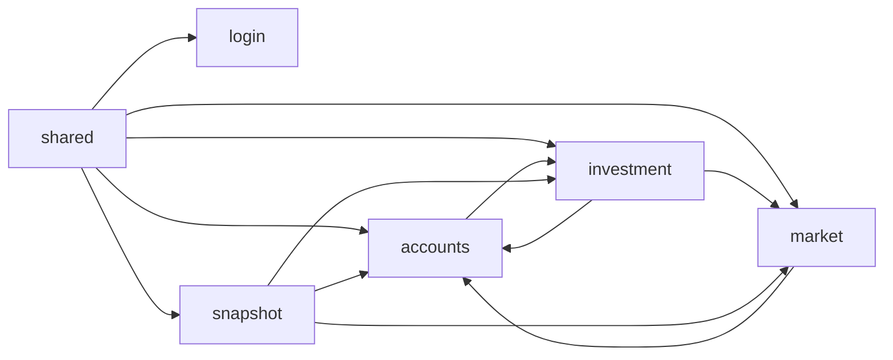

# System Architecture

## 1. 系统定位

`mango_project` 是一个以 Django + DRF 为核心的个人/家庭金融后端，覆盖认证、账户账本、投资交易、行情缓存和历史快照查询。

系统同时有两条主线：

- 在线 API 主线：面向前端的同步读写接口
- 后台任务主线：面向行情同步、汇率刷新、快照采集和聚合的异步任务

## 2. 运行时组成

### 2.1 技术栈

- Web 框架：Django 5 + DRF
- 鉴权：SimpleJWT
- 数据库：PostgreSQL
- 缓存 / Broker：Redis
- 异步任务：Celery + Celery Beat
- 邮件：SMTP
- 外部行情/主数据源：新浪、Binance、Stooq、yfinance、CoinGecko、AkShare、logo.dev

### 2.2 运行时拓扑

## 3. 应用分层

项目基本采用下面的应用内部分层：

- `views`: HTTP 入口，做权限控制和序列化器调度
- `serializers`: 入参/出参约束与最小校验
- `services`: 核心业务编排、跨模型写入、事务边界
- `models`: 数据模型和强约束
- `tasks / management.commands`: 异步任务和运维命令

这套分层总体清晰，但不是完全“瘦模型”架构。`accounts.Transaction.save()` 仍然带有余额更新副作用，因此当前系统属于“服务层主导，少量模型保留关键账本副作用”的混合风格。

## 4. 系统主路由

### 4.1 路由汇总

- `/api/` -> `login`
- `/api/user/` -> `accounts`
- `/api/user/` -> `market`
- `/api/` -> `investment`
- `/api/` -> `snapshot`

### 4.2 设计含义

- `login` 是唯一默认匿名开放的业务域
- `accounts` 和 `market` 面向“当前登录用户”资源，因此统一挂在 `/api/user/`
- `investment` 和 `snapshot` 更偏“专业域”，直接使用业务名前缀

## 5. 跨 app 依赖图

### 5.1 当前依赖关系

### 5.2 解释

- `shared` 是基础层，所有 app 都依赖它
- `investment` 依赖 `accounts` 做资金账本，依赖 `market` 做标的和订阅
- `market` 依赖 `accounts.services.quote_fetcher` 获取行情和汇率
- `snapshot` 是汇总层，读取账户、持仓、行情和汇率缓存

### 5.3 关键耦合

当前最明显的双向耦合有两组：

- `accounts <-> investment`
- `accounts <-> market`

这说明“账本域”“投资域”“行情域”已经区分开了，但抓取器、投资账户同步和任务入口还没有彻底下沉到一致的领域边界中。

## 6. 数据域划分

### 6.1 主数据

- `market.Instrument`: 标的主数据
- Django `auth_user`: 用户主数据
- `accounts.Accounts`: 用户账户主数据

### 6.2 交易数据

- `accounts.Transaction`: 资金账本流水
- `accounts.Transfer`: 双边转账单据
- `investment.InvestmentRecord`: 投资成交记录
- `investment.Position`: 当前持仓状态

### 6.3 缓存数据

- 自选/订阅最新价快照
- 分市场行情快照
- 孤儿行情缓存
- USD 汇率快照
- 核心指数行情快照

### 6.4 历史分析数据

- `snapshot.AccountSnapshot`
- `snapshot.PositionSnapshot`

## 7. 核心业务链路

### 7.1 认证链路

`login` 负责认证、邮箱验证码、注册和密码重置，读写 Django 用户表、Redis 验证码缓存和 SMTP。

### 7.2 账本链路

`accounts` 负责普通账户、手工记账、转账和撤销，是真正的资金账本源头。

### 7.3 投资链路

`investment` 在买卖时同时写：

- `InvestmentRecord`
- `Position`
- `accounts.Transaction`

并同步“投资账户”余额，再更新 `market` 订阅来源。

### 7.4 行情链路

`market` 维护：

- 标的主数据
- 用户订阅表
- Redis 行情快照
- Redis 汇率快照
- Redis 指数快照

### 7.5 历史快照链路

`snapshot` 从账户、持仓、行情和汇率缓存中抽取状态，落成 `M15/H4/D1/MON1` 历史快照表，供查询接口使用。

## 8. 异步任务设计

### 8.1 定时任务

- `accounts.tasks.task_pull_watchlist_quotes`
- `snapshot.tasks.task_capture_m15_snapshots`
- `snapshot.tasks.task_aggregate_h4_snapshots`
- `snapshot.tasks.task_aggregate_d1_snapshots`
- `snapshot.tasks.task_aggregate_mon1_snapshots`
- `snapshot.tasks.task_cleanup_snapshot_history`

### 8.2 队列划分

- `market_sync`
- `snapshot_capture`
- `snapshot_aggregate`
- `snapshot_cleanup`

### 8.3 启动行为

Celery worker 就绪后会通过 Redis 锁触发一次行情补拉。这是一个很明确的“冷启动自修复”设计，目的是避免系统刚启动时 Redis 中没有行情快照。

## 9. 设计优点

- 业务域划分已经基本成型
- API 层和服务层的职责边界清楚
- 快照设计把“实时状态”和“历史分析”分离开了
- 通过 Redis 缓存把行情读取和快照采集连接起来，降低了重复抓取
- 账户、转账、投资卖出等写路径普遍使用事务和行锁，正确性优先

## 10. 当前架构风险

- `accounts` 中放置了部分行情抓取职责，领域归属不够自然
- 投资账户是 `accounts` 表里的特殊账户，但生命周期由 `investment` 维护，责任跨域
- `Transaction.save()` 自带余额写入副作用，测试和批量操作时要非常小心
- `snapshot` 对 `market` 缓存依赖很强，一旦缓存结构变更，影响范围大
- Redis 中“最新价快照”和数据库中的“历史快照”语义接近但实现不同，容易混淆

## 11. 建议的后续阅读重点

如果你是第一次接手这个项目，建议重点先看：

- [03_accounts_app_design.md](./03_accounts_app_design.md)
- [05_investment_app_design.md](./05_investment_app_design.md)
- [04_market_app_design.md](./04_market_app_design.md)

因为这三者共同决定了“钱、仓位、行情”三条主链路。
