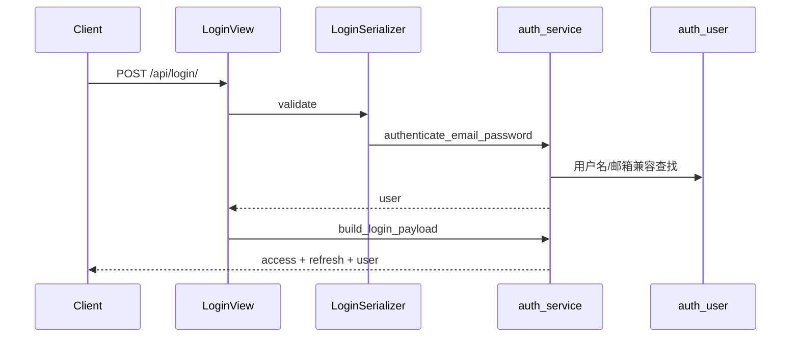

# Login App Design

## 1. 模块定位

`login` 是认证与账号入口模块，负责：

- 用户登录
- JWT token 刷新接入
- 注册邮箱验证码发送
- 邮箱注册
- 重置密码验证码发送
- 密码重置
- 当前用户修改用户名

它不维护独立业务表，直接复用 Django 默认用户模型。

## 2. 设计思路

这个模块的设计重点不是“账号资料中心”，而是“轻量、直接、足够安全的认证入口”：

- 用户主数据交给 Django `auth_user`
- token 签发交给 SimpleJWT
- 邮箱验证码不落库，只放 Redis 缓存
- 所有邮箱验证码只存哈希，不存明文
- 登录兼容历史用户名和邮箱登录

因此它是一个“无本地模型、服务层很薄、依赖框架能力较多”的模块。

## 3. 内部分层

### 3.1 Views

- `LoginView`
- `SendRegisterEmailCodeView`
- `EmailRegisterView`
- `SendPasswordResetEmailCodeView`
- `PasswordResetView`
- `UpdateUsernameView`

### 3.2 Serializers

- `LoginSerializer`
- `SendRegisterEmailCodeSerializer`
- `EmailRegisterSerializer`
- `SendPasswordResetEmailCodeSerializer`
- `PasswordResetSerializer`
- `UpdateUsernameSerializer`

### 3.3 Services

- `auth_service.py`
- `email_code_service.py`

## 4. 数据模型设计

### 4.1 持久化模型

`login` app 本身没有自定义模型文件内容，核心数据使用：

- Django `auth_user`

### 4.2 非持久化模型

验证码通过 Redis 缓存建模：

- `login:register:email-code:{email}`
- `login:password-reset:email-code:{email}`

缓存值结构是：

```json
{
  "code_hash": "..."
}
```

### 4.3 设计含义

- 不需要验证码表，避免清理任务和明文泄漏风险
- 注册验证码与重置密码验证码隔离，避免串用
- 验证码生命周期天然短，适合缓存型数据结构

## 5. 核心业务流程

### 5.1 登录流程



登录顺序是：

1. 优先按 `username` 直登
2. 再按邮箱反查真实用户名
3. 最后按用户名大小写兜底

### 5.2 注册流程

1. 发送注册验证码
2. 邮箱写入 Redis 哈希验证码
3. 用户提交 `email + password + code`
4. 校验邮箱未注册
5. 校验验证码有效
6. 创建 Django 用户，默认 `username=email`
7. 清理注册验证码缓存

### 5.3 重置密码流程

1. 对已注册邮箱发送验证码
2. Redis 写入重置密码验证码
3. 用户提交 `email + password + code`
4. 校验验证码
5. 调用 Django `set_password`
6. 清理重置验证码缓存

### 5.4 用户名修改流程

1. 校验已登录
2. 校验用户名非空、去首尾空格
3. 校验全局唯一
4. 更新 `auth_user.username`

## 6. 依赖关系

### 6.1 输入依赖

- Django Auth User
- Django Cache
- Django Mail / SMTP
- `rest_framework_simplejwt`
- `shared.exceptions.LoginFailedError`

### 6.2 输出依赖

这个模块基本不被其他业务 app 直接依赖，属于系统入口层。

## 7. 设计优点

- 复用 Django/SimpleJWT，避免自造认证系统
- 验证码不落库，状态管理简单
- 邮箱和历史用户名兼容，迁移成本低
- 失败口径通过 `shared.exception_handler` 统一

## 8. 设计边界

`login` 当前只处理“认证”和“极薄的账号属性修改”，没有用户资料域，也没有 profile、偏好设置、头像等概念。这个边界是清晰且健康的。
