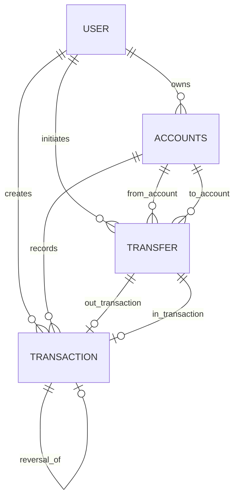

# Accounts App Design

## 1. 模块定位

`accounts` 是整个系统的资金账本域，负责：

- 用户账户主数据
- 手工流水
- 账户间转账
- 流水删除与撤销
- 币种转换辅助
- 行情/汇率拉取的当前实现入口

如果把系统看成“账、仓、价”三层，`accounts` 负责“账”。

## 2. 设计思路

这个模块的核心设计目标是“资金正确性优先”：

- 所有会改余额的操作都围绕 `Transaction` 展开
- 通过事务和 `select_for_update()` 保证并发安全
- 转账不直接改余额，而是拆成两条资金流水
- 撤销不删除原流水，而是创建反向冲正流水

因此它本质上是一个“账本先行”的设计，而不是单纯的账户 CRUD。

## 3. 内部分层

### 3.1 对外接口

- `AccountViewSet`
- `TransactionViewSet`
- `TransferViewSet`

### 3.2 核心服务

- `account_service.py`
- `transaction_service.py`
- `transaction_query_service.py`
- `transaction_delete_service.py`
- `transfer_service.py`
- `currency_service.py`

### 3.3 任务与命令

- `tasks.py`：市场行情同步任务入口
- `management/commands/sync_symbols.py`：标的主数据同步

这两部分从领域归属上更偏 `market`，但当前实现放在 `accounts` 中，是架构上最明显的边界混杂点之一。

## 4. 数据模型设计

### 4.1 `Accounts`

职责：

- 表示用户的现金、银行卡、券商、加密、投资等账户

关键字段：

- `user`
- `name`
- `type`
- `currency`
- `balance`
- `status`

关键约束：

- `unique_together(user, name, currency)`
- 同一用户只允许有一个名称为“投资账户”的 `investment` 类型账户

设计含义：

- 普通账户由用户管理
- “投资账户”是系统账户，不是用户自由账户

### 4.2 `Transaction`

职责：

- 记录所有资金变动

关键字段：

- `amount`
- `balance_after`
- `account`
- `user`
- `source`
- `reversal_of`
- `reversed_at`

关键设计：

- `save()` 会锁账户并直接更新 `Accounts.balance`
- 创建后不允许修改 `account / amount / add_date / reversal_of / source`
- 禁止直接 `delete()`

这说明 `Transaction` 不是单纯事件记录，而是“记账 + 更新账户余额”的核心执行单元。

### 4.3 `Transfer`

职责：

- 表示一笔双边转账业务单据

关键字段：

- `from_account`
- `to_account`
- `amount`
- `status`
- `out_transaction`
- `in_transaction`
- `reversed_out_transaction`
- `reversed_in_transaction`

关键约束：

- `from_account != to_account`

设计含义：

- 转账是业务单据
- 真正改账的是关联的两条 `Transaction`
- 撤销转账时再生成两条冲正流水

## 5. 数据关系图

## 6. 核心业务流程

### 6.1 账户创建与更新

- 普通账户允许创建和更新
- 投资账户禁止手工创建
- 投资账户只允许改币种，且币种变化由 `investment` 域重新估值后同步
- 删除账户采用“归档”而不是真删

### 6.2 手工记账流程

1. 校验账户属于当前用户
2. 禁止对投资账户手工记账
3. 创建 `Transaction`
4. `Transaction.save()` 自动改账户余额

### 6.3 流水撤销流程

1. 锁原流水和账户
2. 禁止撤销冲正流水
3. 禁止重复撤销
4. 如果该流水属于转账，则改走转账撤销
5. 如果该流水关联投资交易，则禁止直接撤销
6. 创建反向 `Transaction`
7. 标记原流水 `reversed_at`

### 6.4 转账流程

1. 锁转出、转入账户
2. 校验同用户、同币种、余额足够、账户非投资账户
3. 创建 `Transfer`
4. 创建转出流水
5. 创建转入流水
6. 把两条流水绑定回 `Transfer`

### 6.5 转账撤销流程

1. 锁 `Transfer`
2. 锁原始双边流水
3. 校验未撤销
4. 创建两条反向冲正流水
5. 更新 `Transfer.status = reversed`

### 6.6 流水删除流程

当前实现允许删除：

- 单条原始手工流水
- 某一类可删除流水批量删除

删除时会一起删掉关联冲正流水，并解除 `InvestmentRecord.cash_transaction` 的绑定。

这里的设计含义是：

- “撤销”是保留审计链路的业务动作
- “删除”更像面向用户的清理动作，适用于非转账类流水

## 7. 依赖关系

### 7.1 输入依赖

- `shared`：异常、时间、Decimal、约束、代码标准化
- `investment.services.account_service`
- `market.services.snapshot_sync_service`（通过 task 入口）
- `market.models.Instrument`（通过主数据同步命令间接写入）

### 7.2 输出依赖

- `investment` 依赖 `Accounts / Transaction`
- `snapshot` 依赖 `Accounts`
- `market` 依赖 `accounts.services.quote_fetcher`

## 8. 设计优点

- 账本语义清晰，所有资金变化可追踪
- 转账通过双边流水建模，便于审计
- 冲正而非覆盖原记录，保留业务历史
- 大多数关键写路径都显式加锁，正确性优先

## 9. 当前架构问题

### 9.1 模型副作用较重

`Transaction.save()` 直接更新账户余额，优点是账本一致性强，缺点是：

- 批量操作时要非常小心
- 逻辑入口不只在 service
- 测试和维护需要记住模型层存在副作用

### 9.2 领域边界混杂

- 行情抓取和标的同步目前放在 `accounts.services/management.commands`
- 市场同步 Celery task 入口也放在 `accounts.tasks`

从领域设计角度，这些能力更应该归属 `market`。

### 9.3 与 investment 双向耦合

- `accounts` 需要调用 `investment` 同步投资账户
- `investment` 又要写 `accounts.Transaction`

这是当前项目里最值得后续重构的耦合点之一。
