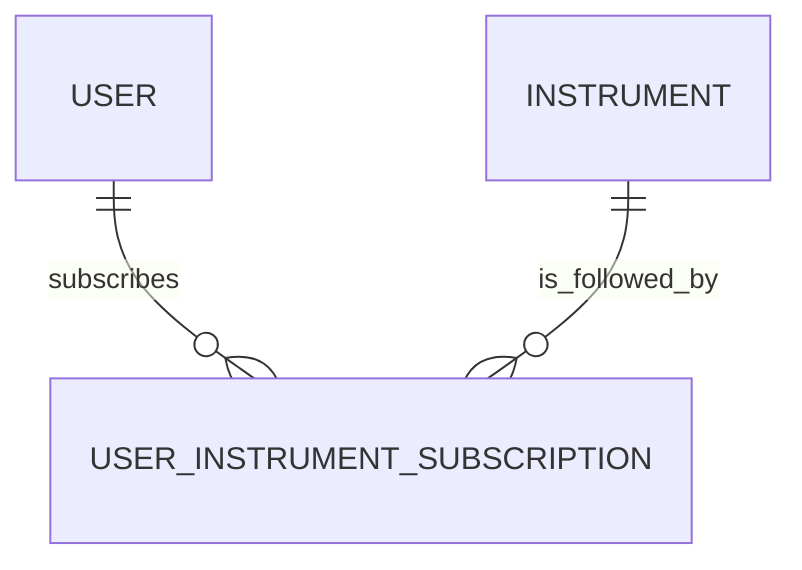
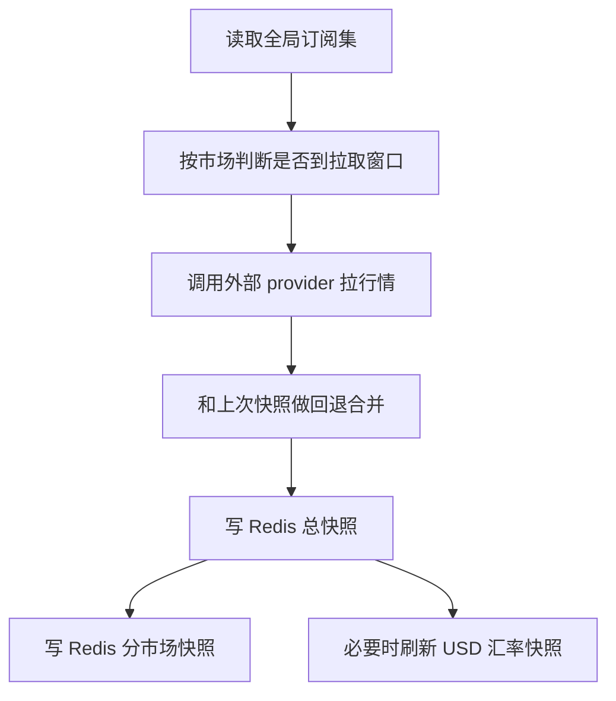

# Market App Design

## 1. 模块定位

`market` 是行情与标的域，负责：

- 标的主数据
- 用户订阅关系
- 自选管理
- 实时行情缓存
- 汇率缓存
- 核心指数快照
- 市场交易日守卫
- logo 元数据维护

如果把系统看成“账、仓、价”三层，`market` 负责“价”和“标的”。

## 2. 设计思路

这个模块的核心思路不是做一个完整的行情中心，而是做一个“面向当前用户订阅集的轻量行情缓存层”：

- 数据主源是外部 provider，不在数据库长期存储逐笔行情
- 数据落 Redis，而不是落 PostgreSQL
- 用户只读取自己关注的标的集合
- 定时任务把“全局订阅集”转换成 Redis 快照

因此 `market` 的重点是：

- 主数据标准化
- 订阅收敛
- 缓存构建
- 读取路径低延迟

## 3. 内部分层

### 3.1 对外接口

- `MarketsView`
- `MarketIndexSnapshotView`
- `MarketFxRatesView`
- `MarketInstrumentSearchView`
- `MarketLatestQuoteBatchView`
- `MarketWatchlistAddView`

### 3.2 核心服务

- `instrument_service.py`
- `query_service.py`
- `watchlist_service.py`
- `subscription_query_service.py`
- `quote_snapshot_service.py`
- `snapshot_sync_service.py`
- `fx_rate_service.py`
- `index_quote_service.py`
- `calendar_guard_service.py`
- `logo_service.py`

### 3.3 命令

- `sync_core_indices`
- `sync_logo_data`
- `build_market_calendar_csv`

## 4. 数据模型设计

### 4.1 `Instrument`

职责：

- 统一管理可交易标的主数据

关键字段：

- `symbol`
- `short_code`
- `name`
- `asset_class`
- `market`
- `exchange`
- `base_currency`
- `logo_url / logo_color / logo_source / logo_updated_at`
- `is_active`

设计含义：

- `symbol` 是全局标准代码
- `short_code` 是市场内短代码
- `base_currency` 决定投资交易使用哪个币种账户
- logo 信息直接和标的主数据绑定，方便前端展示

### 4.2 `UserInstrumentSubscription`

职责：

- 表示“用户和标的之间的订阅关系”

关键字段：

- `user`
- `instrument`
- `from_position`
- `from_watchlist`

关键约束：

- `(user, instrument)` 唯一
- `from_position` 和 `from_watchlist` 至少一个为真

设计含义：

- 自选和持仓共用一张订阅表
- 同一条订阅可以同时被两个来源持有
- 当两个来源都关闭时，订阅行自动删除

## 5. 缓存模型设计

当前市场域的核心状态不在数据库，而在 Redis。

### 5.1 主要缓存键

- `watchlist:quotes:latest`
- `watchlist:quotes:market:{market}`
- `watchlist:quotes:orphan:{market}:{short_code}`
- `watchlist:fx:usd-rates:latest`
- `market:index:quotes:latest`
- `market:index:quotes:market:{market}`

### 5.2 设计含义

- 总快照用于批量读取
- 分市场快照用于局部更新和状态追踪
- 孤儿行情用于“最后一个订阅删除后暂存，再次加回时复用”
- 汇率和指数缓存独立维护，不混入普通自选行情

## 6. 数据关系图

## 7. 核心业务流程

### 7.1 自选添加流程

1. 按 `symbol` 查活跃 `Instrument`
2. 禁止指数加入自选
3. 打开 `from_watchlist`
4. 尝试命中总缓存
5. 若未命中，则尝试命中孤儿缓存
6. 若仍未命中，则调用单标的拉取
7. 把行情写回总快照和分市场快照

### 7.2 自选删除流程

1. 按 `symbol` 或 `market + short_code` 找当前用户自选订阅
2. 关闭 `from_watchlist`
3. 如果该标的仍有其他来源订阅，则保留快照
4. 如果没有任何订阅来源，则从总快照移除
5. 被移除的行情写入孤儿缓存

### 7.3 市场快照同步流程

这里的关键点是：

- 不是拉“全市场”，而是拉“全局订阅集”
- 允许由于休市/未到窗口而复用旧缓存
- 缺口修复和冷启动属于显式设计的一部分

### 7.4 指数快照流程

1. 读取核心指数标的表
2. 根据 provider 和市场日历决定是否拉取
3. 拉不到新数据时回退旧缓存
4. 输出统一 `items` 结构给前端

### 7.5 汇率读取流程

1. 优先读 USD 汇率缓存
2. 缓存缺失时从 FX 快照或外部源即时补拉
3. 以 USD 为基准重算请求币种的汇率视图

## 8. 订阅语义说明

这里有一个很关键但容易混淆的设计点：

- `snapshot_sync_service.global_subscription_meta_by_market()` 使用的是“全局订阅集”，包含 `from_position` 和 `from_watchlist`
- `build_user_markets_snapshot()` 面向用户市场页时使用的是 `user_watchlist_codes_by_market()`，只返回当前用户的自选来源集合

也就是说：

- Redis 行情同步范围大于用户市场页展示范围
- 持仓来源会驱动后台缓存保温
- 但当前市场页展示仍以“自选视图”为主

这是当前代码的真实行为，设计上必须分清。

## 9. 依赖关系

### 9.1 输入依赖

- `shared`
- `accounts.services.quote_fetcher`
- `accounts.services.pull_usd_exchange_rates`
- Redis cache
- 外部行情 provider

### 9.2 输出依赖

- `investment` 依赖 `Instrument`、订阅服务和单标的行情预热
- `snapshot` 依赖行情快照与汇率快照
- `accounts.tasks` 依赖市场同步服务作为 Celery 任务入口

## 10. 设计优点

- 主数据、订阅、缓存三层清晰分离
- 查询接口都建立在缓存之上，读路径轻
- 用 `from_position/from_watchlist` 很好地建模了订阅来源
- 有冷启动、修复、孤儿行情回收等细节设计，实用性强

## 11. 当前架构问题

### 11.1 Provider 层归属不自然

真正的外部抓取能力在 `accounts.services.quote_fetcher`，从领域角度应该属于 `market`。

### 11.2 用户视图和全局缓存语义不同

后台同步按全局订阅集，用户市场页按 watchlist 视图，这个差异是合理的，但如果没有设计文档说明，非常容易误读。

### 11.3 Redis 是强依赖

`market` 不是“有缓存更快”，而是“缓存就是运行时主数据”。这意味着：

- Redis 结构变更影响面很大
- 快照服务、投资估值、汇率读取都会受影响

## 12. 维护建议

如果后续重构市场域，优先级建议是：

1. 把 provider 抓取逻辑从 `accounts` 迁回 `market`
2. 明确“用户市场页”和“全局订阅快照”的语义边界
3. 把 Redis payload 结构做版本化管理，降低下游破坏性
