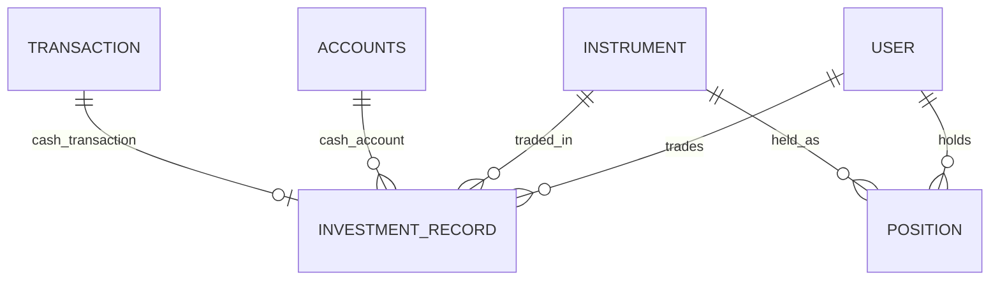

# Investment App Design

## 1. 模块定位

`investment` 是投资交易与持仓域，负责：

- 买入和卖出
- 当前持仓维护
- 投资历史查询
- 系统投资账户同步估值

如果把系统看成“账、仓、价”三层，`investment` 负责“仓”，但它会同时驱动“账”和部分“价”的订阅关系。

## 2. 设计思路

这个模块的核心设计思想是：

- `InvestmentRecord` 负责记录交易历史
- `Position` 负责维护当前状态
- 真正的现金变动落到 `accounts.Transaction`
- 持仓变化会反向驱动 `market.UserInstrumentSubscription`
- 当前投资资产总值通过系统“投资账户”映射回 `accounts`

因此它不是独立闭环，而是整个系统最强的跨域编排中心之一。

## 3. 内部分层

### 3.1 对外接口

- `InvestmentBuyView`
- `InvestmentSellView`
- `InvestmentPositionListView`
- `InvestmentPositionDeleteView`
- `InvestmentHistoryListView`

### 3.2 核心服务

- `trade_service.py`
- `query_service.py`
- `account_service.py`
- `valuation_service.py`

## 4. 数据模型设计

### 4.1 `InvestmentRecord`

职责：

- 记录每一笔买卖交易

关键字段：

- `user`
- `instrument`
- `side`
- `quantity`
- `price`
- `cash_account`
- `cash_transaction`
- `trade_at`
- `realized_pnl`

关键约束：

- `quantity > 0`
- `price > 0`
- BUY 时 `realized_pnl` 必须为空
- SELL 时 `realized_pnl` 必须非空
- `cash_account / cash_transaction / user` 必须一致

设计含义：

- 历史记录是不可逆的业务事实
- 资金流水和成交记录通过 `cash_transaction` 强绑定

### 4.2 `Position`

职责：

- 表示用户当前持仓状态

关键字段：

- `user`
- `instrument`
- `quantity`
- `avg_cost`
- `cost_total`
- `realized_pnl_total`

关键约束：

- `(user, instrument)` 唯一
- 所有数量和成本都不能为负
- `quantity=0` 时 `avg_cost=0` 且 `cost_total=0`

设计含义：

- `Position` 是状态表，不是流水表
- 历史由 `InvestmentRecord` 保存，当前状态由 `Position` 汇总

## 5. 数据关系图

## 6. 核心业务流程

### 6.1 买入流程

1. 校验标的存在、可交易、非指数
2. 锁定资金账户
3. 校验账户币种与标的计价币种一致
4. 锁定或创建 `Position`
5. 计算买入成本并校验余额充足
6. 创建 `accounts.Transaction(source=investment)`
7. 更新 `Position.quantity / cost_total / avg_cost`
8. 打开 `market` 订阅来源 `from_position`
9. 同步系统投资账户估值
10. 提交后异步预热该标的行情快照
11. 创建 `InvestmentRecord`

### 6.2 卖出流程

1. 校验标的与资金账户
2. 锁定持仓
3. 校验持仓数量足够
4. 计算卖出金额与已实现收益
5. 创建正向入账的 `accounts.Transaction`
6. 扣减或删除 `Position`
7. 若仓位归零，则关闭 `from_position`
8. 同步系统投资账户估值
9. 创建 `InvestmentRecord`

### 6.3 删除零持仓流程

只允许删除 `quantity=0` 的持仓行，用于清理状态表残留，并同步关闭该标的的持仓订阅来源。

### 6.4 投资账户同步流程

这是当前设计里非常关键的一条隐式业务链：

1. 读取用户所有非零持仓
2. 从 Redis 行情快照读取最新价
3. 从 Redis 汇率快照读取 USD 汇率
4. 计算总 USD 估值
5. 折算到目标账户币种
6. 在 `accounts.Accounts` 中创建或更新唯一的“投资账户”
7. 如果没有持仓，则归档投资账户

也就是说，“投资账户”并不是独立维护的业务实体，而是持仓状态的投影视图。

## 7. 依赖关系

### 7.1 输入依赖

- `accounts.Accounts`
- `accounts.Transaction`
- `accounts.services.currency_service`
- `market.Instrument`
- `market.subscription_service`
- `market.services.quote_snapshot_service`
- `shared`

### 7.2 输出依赖

- `accounts` 通过系统投资账户接收估值结果
- `market` 通过订阅来源感知持仓变化
- `snapshot` 通过读取 `Position` 形成历史快照

## 8. 设计优点

- 成交历史和当前状态分表，语义清楚
- 现金流始终回到账本系统，不在投资域重复造账本
- 卖出收益累计逻辑明确
- 投资账户让“投资资产价值”能和普通账户视图统一

## 9. 当前架构问题

### 9.1 与 accounts 深度耦合

`investment` 无法独立存在，因为它：

- 写 `accounts.Transaction`
- 依赖 `accounts.Accounts`
- 反向维护 `accounts` 中的投资账户

这是一种现实可用但耦合较高的设计。

### 9.2 与 market 强耦合

- 标的主数据在 `market`
- 持仓订阅在 `market`
- 投资账户估值要读 `market` 的 Redis 行情快照

这意味着“仓位正确”不仅依赖数据库，还依赖行情缓存是否可用。

### 9.3 系统投资账户是派生实体

投资账户不是主录入实体，而是派生结果。这个设计很好用，但必须在设计上明确，否则很容易误把它当成普通账户。

## 10. 设计边界总结

`investment` 的本质不是资产估值服务，而是“交易 + 持仓状态机 + 资金账本桥接层”。理解这一点，才能正确维护它与 `accounts`、`market` 的协作关系。
