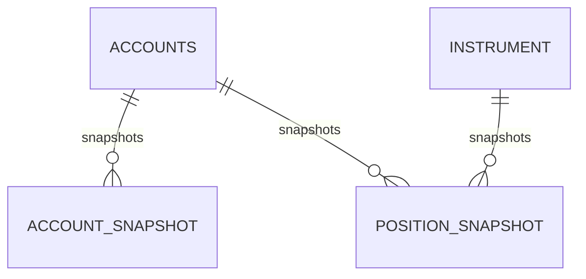
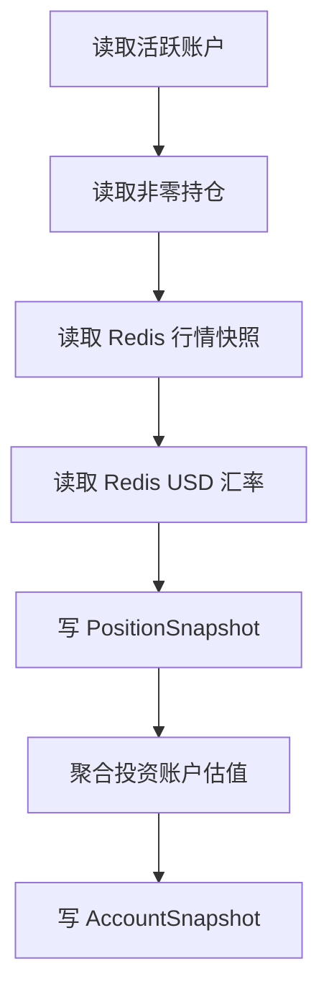

# Snapshot App Design

## 1. 模块定位

`snapshot` 是时序历史域，负责：

- 账户快照采集
- 持仓快照采集
- 粒度聚合
- 过期清理
- 历史矩阵查询

它不参与实时交易正确性，而负责把“当前状态”沉淀成“可查询历史”。

## 2. 设计思路

这个模块的设计核心是：

- 实时数据不直接查历史表
- 定时把当前状态投影到快照表
- 用统一时间桶管理 `M15/H4/D1/MON1`
- 查询接口直接返回前端可绘图的矩阵结果

因此 `snapshot` 是一个典型的“分析投影层”，不是交易主系统。

## 3. 内部分层

### 3.1 对外接口

- `AccountSnapshotQueryView`
- `PositionSnapshotQueryView`

### 3.2 核心服务

- `snapshot_service.py`
- `query_service.py`

### 3.3 Celery 任务

- `task_capture_m15_snapshots`
- `task_aggregate_h4_snapshots`
- `task_aggregate_d1_snapshots`
- `task_aggregate_mon1_snapshots`
- `task_cleanup_snapshot_history`

## 4. 数据模型设计

### 4.1 `AccountSnapshot`

职责：

- 记录某账户在某个时间桶上的余额状态

关键字段：

- `account`
- `snapshot_time`
- `snapshot_level`
- `account_currency`
- `balance_native`
- `balance_usd`
- `fx_rate_to_usd`
- `data_status`

关键约束：

- `(account, snapshot_level, snapshot_time)` 唯一
- `fx_rate_to_usd` 为空或大于 0

### 4.2 `PositionSnapshot`

职责：

- 记录某账户下某标的在某个时间桶上的持仓状态

关键字段：

- `account`
- `instrument`
- `snapshot_time`
- `snapshot_level`
- `quantity`
- `avg_cost`
- `market_price`
- `market_value`
- `market_value_usd`
- `fx_rate_to_usd`
- `realized_pnl`
- `price_time`
- `currency`
- `data_status`

关键约束：

- `(account, instrument, snapshot_level, snapshot_time)` 唯一
- 数量和成本不为负
- `data_status=ok` 时，价格和值必须完整

## 5. 数据关系图

## 6. 核心业务流程

### 6.1 M15 采集流程

### 6.2 账户快照采集逻辑

- 普通账户：直接取 `Accounts.balance`，折算 USD
- 投资账户：不直接用账户表余额，而是以持仓估值结果为准

这说明 `snapshot` 把投资账户视为“持仓汇总结果”，不是普通资金账户。

### 6.3 持仓快照采集逻辑

1. 读取 `Position`
2. 根据标的市场和代码从 Redis 行情快照取最新价
3. 若无行情，标记 `quote_missing`
4. 若无汇率，标记 `fx_missing`
5. 写入价格、价值、价值 USD、收益等字段

### 6.4 聚合流程

- `H4` 优先从 `M15`
- `D1` 优先从 `H4`，回退 `M15`
- `MON1` 优先从 `D1`，再回退更细粒度

聚合策略是“取窗口内最新一条”，而不是做平均/求和。

### 6.5 查询流程

1. 校验 `level / start_time / end_time / limit`
2. 对齐时间桶
3. 读取满足窗口的快照行
4. 组装为前端直接消费的矩阵结构
5. 返回 `meta + series`

## 7. 状态设计

### 7.1 `SnapshotDataStatus`

- `ok`
- `quote_missing`
- `fx_missing`

设计含义：

- 快照并不要求所有数据完整才写入
- 允许“部分可用”并把原因显式暴露给查询层

这是一种很实用的分析系统设计，因为它避免了“行情缺失时整条时间轴断掉”。

## 8. 时间设计

### 8.1 快照粒度

- `M15`
- `H4`
- `D1`
- `MON1`

### 8.2 保留策略

- `M15`: 1 天
- `H4`: 30 天
- `D1`: 90 天
- `MON1`: 当前代码中没有单独清理策略，默认长期保留

### 8.3 时间桶能力来源

统一由 `shared.time.buckets` 提供，对齐规则在所有查询和采集中保持一致。

## 9. 依赖关系

### 9.1 输入依赖

- `accounts.Accounts`
- `investment.Position`
- `market` 的 Redis 行情快照
- `market` 的 USD 汇率快照
- `shared` 的时间桶和 Decimal 工具

### 9.2 输出依赖

- 前端历史图表
- 任何需要时间序列分析的下游能力

## 10. 设计优点

- 实时状态和历史分析彻底分离
- 采集、聚合、清理三条职责分明
- 查询接口直接输出前端需要的矩阵结构
- 用 `data_status` 表达部分缺失，比直接丢数据更稳健

## 11. 当前架构问题

### 11.1 对 market 缓存依赖强

快照采集不直接抓行情，而完全依赖 `market` 域已有缓存。这是合理的性能设计，但也意味着：

- Redis 缓存损坏会直接影响快照质量
- `market` payload 结构变更要联动改 `snapshot`

### 11.2 投资账户快照是派生值

投资账户快照不是来自账户表余额，而是来自持仓估值，这要求维护者理解“投资账户”是派生视图，而不是原始账本。

### 11.3 查询层是面向前端裁剪后的视图

当前查询接口故意不返回全部字段，而只返回绘图必要字段。这有利于前端，但如果未来引入更复杂分析口径，需要扩展新的查询 DTO，而不是直接放大当前响应。

## 12. 设计边界总结

`snapshot` 是典型的投影层和分析层，不应该承接交易逻辑。它最重要的设计价值不是“存快照”，而是“把跨域实时状态稳定地转成可查询历史”。
